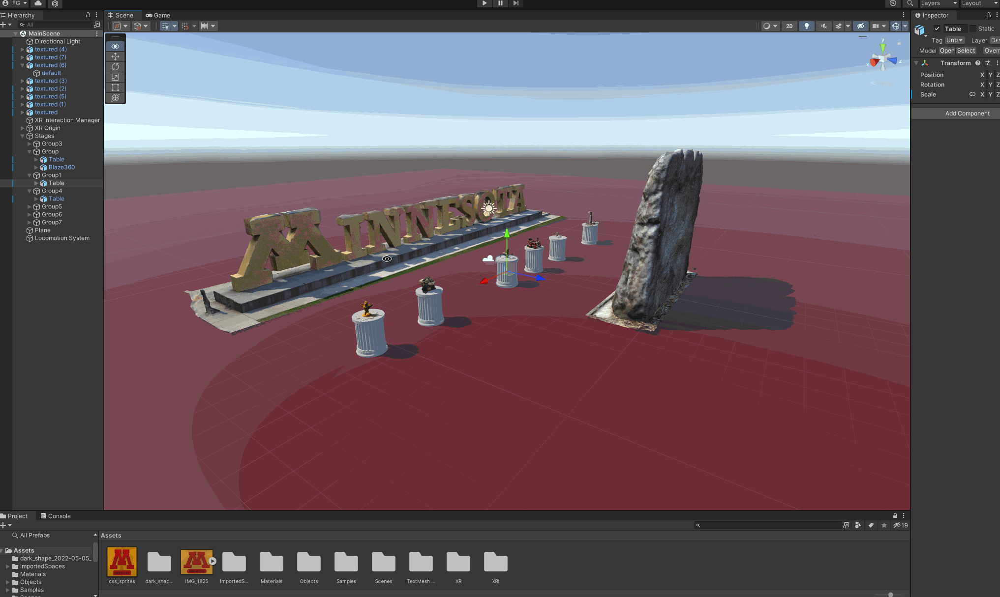

# 👋 Hi, I’m a comercial drone pilot, master of photogrammetry & VR who builds & codes Open Source robots. 
Cool Open Source Projects I've worked on: \
[GoldyDogV7](https://github.com/umn-vr/goldydogv7) &nbsp; [RONALD360](https://github.com/Felipegalind0/RONALD360) &nbsp; [Insta360-Drone-Mount](https://github.com/Felipegalind0/Insta360-Drone-Mount) &nbsp; [Quest-2-App](https://github.com/UMN-VR/UMN-VR-Quest-2-App) &nbsp; [UMN-RI3D-2023](https://github.com/GOFIRST-Robotics/Ri3D-2023)

-🎥 360 Drone Tour Videos: [Marshall School](https://www.youtube.com/watch?v=OoCohYn445I&list=PLL9sMwxqcFqGlZlUxdoyjaeGB9wY5OsT1)

-🌐 Web: [**felipegalind0.github.io**](https://felipegalind0.github.io) &nbsp; &nbsp; [umn-vr.github.io](https://umn-vr.github.io) &nbsp; &nbsp; [goldy.dog](https://goldy.dog)

-🎨 Polycam :[poly.cam/@Felipegalind0](https://poly.cam/@Felipegalind0)

-📚 Git: **[github.com/Felipegalind0](https://github.com/Felipegalind0)** &nbsp; &nbsp; [github.com/UMN-VR](https://github.com/UMN-VR)

-🎦 YT: [**youtube.com/@Felipegalind0**](https://www.youtube.com/@Felipegalind0) [youtube.com/@UMN-VR](https://www.youtube.com/@UMN-VR)

-😎 WebVR(Open these w/ a VR Headset): [GoldyDogV7 w/ Insta360 1:1](https://goldydogv7.glitch.me) &nbsp; &nbsp; [RONALD360 1:1](https://ronald360-showcase.glitch.me)

    
<section class="core-section-container my-3 core-section-container--with-border border-b-1 border-solid border-color-border-faint m-0 py-3 pp-section experience">
<!---->
        
        <h2 class="core-section-container__title section-title">
            
    Experience
    
        </h2>
    
    
<!---->
    

    
    <ul class="experience__list">
            

<li class="profile-section-card  experience-item" data-section="currentPositionsDetails">
<!---->          

    

    <h3 class="profile-section-card__title">
        
    Co-Founder
    
    </h3>

        <h4 class="profile-section-card__subtitle">
            <a class="profile-section-card__subtitle-link" href="https://www.linkedin.com/company/umn-vr?trk=public_profile-settings_experience-item_profile-section-card_subtitle-click" data-tracking-control-name="public_profile-settings_experience-item_profile-section-card_subtitle-click" data-tracking-will-navigate>
            
    UMN VR
    
            </a>
        </h4>

    

    

        
        

        

    
<time>Nov 2021</time> - Present1 year 10 months
    

        

        

        526 Delaware Street SE, Minneapolis, MN 55455
        

<!---->      
    

    

    
</li>

            

<li class="profile-section-card  experience-item" data-section="currentPositionsDetails">
<!---->          

    

    <h3 class="profile-section-card__title">
        
    Project Director
    
    </h3>

        <h4 class="profile-section-card__subtitle">
            <a class="profile-section-card__subtitle-link" href="https://www.linkedin.com/company/tesla-works?trk=public_profile-settings_experience-item_profile-section-card_subtitle-click" data-tracking-control-name="public_profile-settings_experience-item_profile-section-card_subtitle-click" data-tracking-will-navigate>
            
    Tesla Works
    
            </a>
        </h4>

    

    

        
        

        

    
<time>Aug 2021</time> - Present2 years 1 month
    

        

<!---->
<!---->      
    

    

    
</li>

            

<li class="profile-section-card  experience-item" data-section="pastPositionsDetails">
<!---->          
    

    

    <h3 class="profile-section-card__title">
        
    Database Manager/ Software Engineer
    
    </h3>

        <h4 class="profile-section-card__subtitle">
            
    Washington Elite Dentistry
    
        </h4>

    

    

        
        

        

    
<time>Sep 2019</time> - <time>Jul 2023</time>3 years 11 months
    

        

        

        555 12th St. NW, Suite L-300, Washington DC 20004, United States
        

<!---->      
    

    

    
</li>

    </ul>
    
    

</section>
  
  
  
          
<!---->
<!---->
<!---->
<!---->
<!---->
<!---->
<!---->
<!---->
<!---->
<!---->
<!---->
<!---->
<!---->
<!---->
<!---->
<!---->
<!----><!----><!---->
<!---->

- 👀 I’m interested in Drones, Photogrammetry Applications, 360 videography, WebXR Development in Babylon.js, Unity, ROS, Python, SwiftUI, cpp, Inverse Kinematics & more. 
-  🧑‍💻 Coding is my passion. I hate working with hardware, but I guess I'm ok at that too. 
-  🙃I’m currently living in Minneapolis, and frankly I don't like it, Duluth is better. 
-  ⚡ Fun fact: I dropped a phone from the Golden Gate, sometimes I'm not the brightest :/
-  🇨🇴 I was born in Colombia and speak fluent spanish. 
-  🇺🇸 I live in the states so I speak English, duh.
-  🇩🇪 My sister was learning French, I wanted to learn a third language to match her, and I met this cute girl who spoke german so i decided I was going to learn german and I did.(Sort of) 
- 🧸 I'm proud of who I am, what I have built, and what I am building.
- 💞️ I’m looking to collaborate on anything, please reach out to me.
- 👊🏻 If you're like me and you rely on Open Source Hardware and Software(literally everyone in the planet), you shoud make your projects Open Source. 
- 📖 I was working in a CS degree at UMN but they are broke and will only let me study for sticker price so probably switching schools. 

-📧 Mail : **felipegalind0@outlook.com**(prefered) \
(gali070@umn.edu, felipht@stanford.edu, gali1383@marshallschool.org.)

-👾 Discord : FelipeGalind0#9289

#### 📫 The best way to reach me is to send me an email. 

I've been working on a CS degree at UMN for the past two years, I went to Marshall School & Stanford Summer Session 2019. I’m interested in Drones, Photogrammetry, WebXR Development in Babylon.js and VR Develoment in general. I designed my own [Robot Dog](https://github.com/UMN-VR/GoldyDogV7), and made a hobby of CADing [360 camera attachments for a Drone](https://github.com/Felipegalind0/Insta360-Drone-Mount), an [Omnidirectional Robot](https://github.com/Felipegalind0/RONALD360), among other things. I'm an early adopter of imersive tech, ever since I got my Gear VR I always fly with a VR headset and Beat Saber keeps me in shape. Looking to use my part 107 licence for more productive stuff so [send me an email](mailto:felipegalind0@outlook.com) if you want to work with me! If you're an admissions officer plz [poach me](mailto:felipegalind0@outlook.com) I can't aford UMN :( Looking for a Job at a company that aligns with my values and chalenges me to grow my skills, [send me an email](mailto:felipegalind0@outlook.com).

## Some of the things I have worked on:

### [GoldyDogV7](https://github.com/umn-vr/goldydogv7):
An Open Source Boston Dynamics inspired Lightweight Quadruped Robotics Platform with a MPU-6050, LiDAR A1, RP4B, Insta360, 4g connectivity  & an Airtag.\
\
[GoldyDogV7 w/ Insta360 3D Model.](https://poly.cam/capture/2E7A09DC-651E-457D-BC65-34B380F1FFC4)\
[GoldyDogV7 w/ Insta360 1:1 WebVR Model.](https://goldydogv7.glitch.me)
 

\
[GoldyDogV7 w/ Insta360 CAD Model](https://collaborate.shapr3d.com/v/TyNZZo2E9wQ8442WcQJLR)
 

\
 

### [RONALD360](https://github.com/Felipegalind0/RONALD360)
An open source, cheap, 4-mecanum-wheel robot capable of swiftly navigating very flat surfaces through teleoperation via a 360 camera which I used to capture the [images for the Google MyBuisness Profile of Marshall School](https://www.google.com/maps/@46.8022282,-92.1112777,3a,74.999992y,80.000000h,70.000000t/data=!3m4!1e1!3m2!1sAF1QipODNp847Mb8b0sOGfNKKHw4TO0llD69eYGQX63N!2e10?shorturl=1)\
\
[RONALD360 3D Model](https://poly.cam/capture/DC0F4DF9-0BF0-4654-9EB7-D0CA191B5B42)\
[RONALD360 1:1 WebVR Model](https://ronald360-showcase.glitch.me)\

### [VR Photogrammetry Quest-2-App](https://github.com/UMN-VR/UMN-VR-Quest-2-App)
An Open Source demonstration of photogrammetry in VR, made in Unity for Quest 2 & WebVR\
\
 

### [Insta360 Drone Mount](https://github.com/Felipegalind0/Insta360-Drone-Mount)
An Open Source Carbon Fiber Nylon Insta360 Drone Mount capable of flying on a A2S at full speed for up to 18 Minutes\
\
[News Article](https://www.continuum.umn.edu/2022/02/students-take-library-equipment-to-new-heights/)  &nbsp; &nbsp; [Thingverse Page](https://www.thingiverse.com/thing:5532281)

 

 

 

## And Much More... 

 

 

[FRCTeam4230](https://github.com/FRCTeam4230/MainBot-Code-2019)

Designed Washington Elite Dentistry's:
&nbsp; &nbsp; [vCard](https://bit.ly/3jZF23u) &nbsp; &nbsp; [Google Profile](https://goo.gl/maps/nsrmrbN7LEPHzhZ57) &nbsp; &nbsp; [Website](https://www.washingtonelitedentistry.com)

[Code for this website](https://github.com/Felipegalind0/Felipegalind0.github.io)

<!---
Felipegalind0/Felipegalind0 is a ✨ special ✨ repository because its `README.md` (this file) appears on your GitHub profile.
You can click the Preview link to take a look at your changes.
--->
